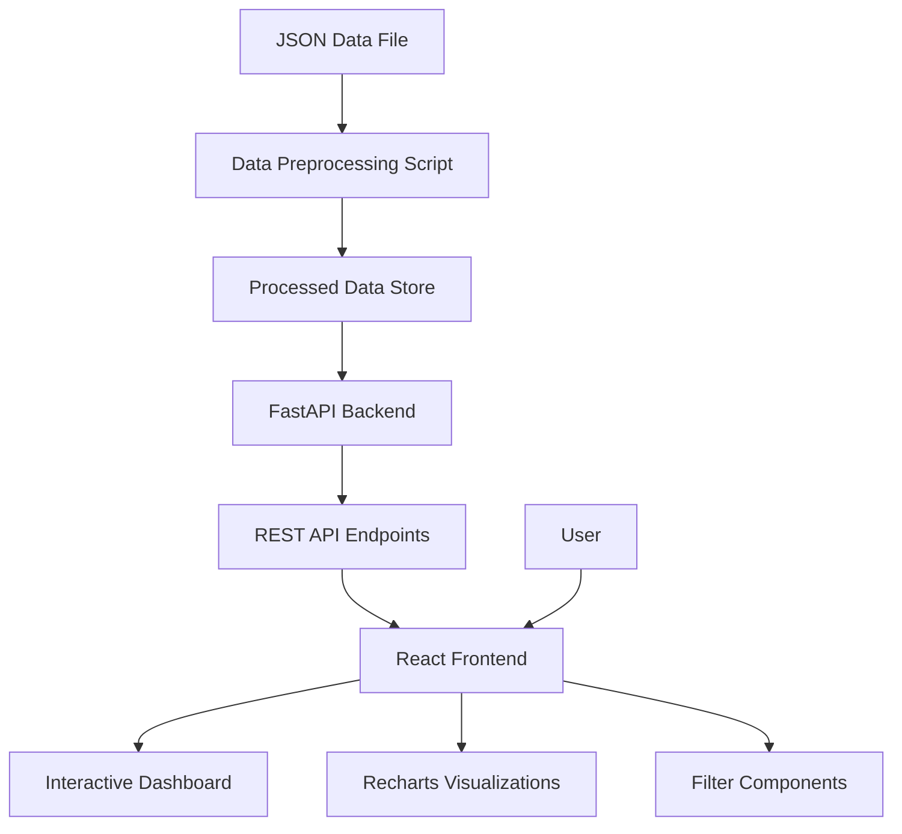

# Design Document

## Overview

The Financial Dashboard is a full-stack web application built with React frontend and FastAPI backend. The system processes short-term rental data to provide interactive analytics through charts and filters. The architecture emphasizes data preprocessing for performance, clean API design, and responsive user experience.

## Architecture

### High-Level Architecture



### Technology Stack

**Backend:**
- FastAPI (Python 3.9+)
- Pandas for data processing
- Pydantic for data validation
- Uvicorn ASGI server

**Frontend:**
- React 18 with TypeScript
- Recharts for data visualization
- Shadcn/ui component library
- TailwindCSS for styling
- React Query for API state management

**Development Tools:**
- Concurrently for running both services
- Pytest for backend testing
- Jest/React Testing Library for frontend testing

## Components and Interfaces

### Backend Components

#### 1. Data Preprocessing Module (`preprocess.py`)

**Purpose:** Transform raw JSON data into optimized aggregates for fast API responses.

**Key Functions:**
- `load_raw_data()`: Parse JSON file and validate structure
- `calculate_revenue_aggregates()`: Create daily revenue summaries
- `calculate_lead_times()`: Compute booking lead time statistics
- `calculate_lost_income()`: Estimate maintenance impact
- `aggregate_reviews()`: Create monthly review summaries

**Output:** Processed data files or in-memory structures optimized for filtering

#### 2. API Service Layer

**Endpoints:**
```python
GET /api/revenue/timeline?start_date=YYYY-MM-DD&end_date=YYYY-MM-DD&property_ids=1,2,3
GET /api/revenue/by-property?start_date=YYYY-MM-DD&end_date=YYYY-MM-DD&property_ids=1,2,3
GET /api/maintenance/lost-income?start_date=YYYY-MM-DD&end_date=YYYY-MM-DD&property_ids=1,2,3
GET /api/reviews/trends?start_date=YYYY-MM-DD&end_date=YYYY-MM-DD&property_ids=1,2,3
GET /api/bookings/lead-times?start_date=YYYY-MM-DD&end_date=YYYY-MM-DD&property_ids=1,2,3
GET /api/properties
```

#### 3. Data Models (Pydantic)

```python
class Property(BaseModel):
    property_id: int
    property_name: str
    reviews_count: int
    average_review_score: float

class RevenuePoint(BaseModel):
    date: str
    revenue: float
    property_id: Optional[int] = None

class LeadTimeStats(BaseModel):
    median_days: float
    p90_days: float
    distribution: List[int]  # histogram bins

class ReviewTrend(BaseModel):
    month: str
    avg_rating: float
    review_count: int
```

### Frontend Components

#### 1. Dashboard Layout
- Header with title and filters
- Grid layout for charts (2x2 or responsive)
- Loading states and error handling

#### 2. Filter Components
- `DateRangePicker`: Start/end date selection
- `PropertyMultiSelect`: Checkbox list of properties
- `FilterProvider`: Context for managing filter state

#### 3. Chart Components
- `RevenueTimelineChart`: Line chart with Recharts
- `RevenueByPropertyChart`: Bar chart with Recharts
- `LostIncomeChart`: Bar chart showing maintenance impact
- `ReviewTrendsChart`: Combined line/bar chart
- `LeadTimeChart`: Histogram or box plot
- `LeadTimeStatsTable`: Median/P90 summary table

#### 4. Data Layer
- `useApiQuery` hooks for each endpoint
- Filter state management with React Context
- Error boundary components

## Data Models

### Raw Data Structure (Input)
```typescript
interface RawData {
  properties: Property[]
  reservations: Reservation[]
  reviews: Review[]
  maintenance_blocks: MaintenanceBlock[]
}

interface Reservation {
  reservation_id: number
  property_id: number
  property_name: string
  guest_name: string
  reservation_date: string  // YYYY-MM-DD
  check_in: string         // YYYY-MM-DD
  check_out: string        // YYYY-MM-DD
  reservation_revenue: number
}
```

### Processed Data Structure (API Responses)
```typescript
interface RevenueTimeline {
  data: Array<{
    date: string
    total_revenue: number
    property_breakdown?: Record<number, number>
  }>
}

interface PropertyRevenue {
  data: Array<{
    property_id: number
    property_name: string
    total_revenue: number
  }>
}

interface LostIncomeData {
  data: Array<{
    property_id: number
    property_name: string
    lost_income: number
    blocked_days: number
  }>
}
```

### Data Processing Logic

#### Revenue Calculation
1. Parse check_in and check_out dates
2. Calculate nights = (check_out - check_in).days
3. Calculate nightly_rate = reservation_revenue / nights
4. For daily aggregation: distribute revenue across stay dates
5. Handle edge cases: same-day bookings, invalid dates

#### Lead Time Calculation
```python
lead_time_days = (datetime.strptime(check_in, '%Y-%m-%d') - 
                 datetime.strptime(reservation_date, '%Y-%m-%d')).days
```

#### Lost Income Estimation
1. For each maintenance block, find historical reservations for same property
2. Calculate average daily rate for that property in similar time periods
3. Multiply average daily rate by blocked_days
4. Aggregate by property and time period

## Error Handling

### Backend Error Handling
- Input validation with Pydantic models
- HTTP status codes: 400 (bad request), 404 (not found), 500 (server error)
- Structured error responses with detail messages
- Logging for debugging and monitoring

### Frontend Error Handling
- React Error Boundaries for component-level errors
- API error states with user-friendly messages
- Fallback UI for failed chart renders
- Loading states during data fetching

### Data Quality Handling
- Skip invalid date formats with logging
- Handle missing or null values gracefully
- Validate numeric fields (revenue > 0, etc.)
- Report data quality issues in preprocessing logs

## Testing Strategy

### Backend Testing
- Unit tests for data processing functions
- API endpoint tests with mock data
- Integration tests with sample JSON file
- Performance tests for large datasets

### Frontend Testing
- Component unit tests with React Testing Library
- Chart rendering tests with mock data
- Filter interaction tests
- Accessibility tests for screen readers

### Test Data
- Use subset of real data for consistent testing
- Mock API responses for frontend tests
- Edge case scenarios: empty data, invalid dates, single property

## Performance Considerations

### Data Processing
- Preprocess data on startup, not per request
- Use pandas for efficient aggregations
- Cache processed results in memory
- Consider data pagination for very large datasets

### API Performance
- Response time target: < 500ms
- Use appropriate HTTP caching headers
- Minimize data transfer with selective fields
- Consider compression for large responses

### Frontend Performance
- Lazy load chart components
- Debounce filter changes to reduce API calls
- Use React.memo for expensive chart renders
- Implement virtual scrolling for large property lists

## Accessibility

### Chart Accessibility
- Alt text for chart images
- Keyboard navigation support
- High contrast color schemes
- Screen reader compatible data tables as alternatives

### UI Accessibility
- ARIA labels for interactive elements
- Focus management for modal dialogs
- Color-blind friendly chart colors
- Minimum 4.5:1 color contrast ratio

## Development Workflow

### Project Structure
```
financial-dashboard/
├── backend/
│   ├── app/
│   │   ├── main.py
│   │   ├── models.py
│   │   ├── api/
│   │   └── services/
│   ├── scripts/
│   │   └── preprocess.py
│   ├── tests/
│   └── requirements.txt
├── frontend/
│   ├── src/
│   │   ├── components/
│   │   ├── hooks/
│   │   ├── types/
│   │   └── utils/
│   ├── public/
│   └── package.json
├── data/
├── docs/
└── docker-compose.yml
```

### Environment Configuration
- `.env` files for API URLs, ports
- Separate configs for development/production
- Environment validation on startup

This design provides a solid foundation for building a performant, maintainable financial dashboard that meets all the specified requirements while following modern web development best practices.